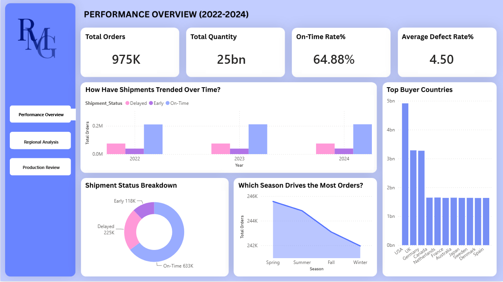
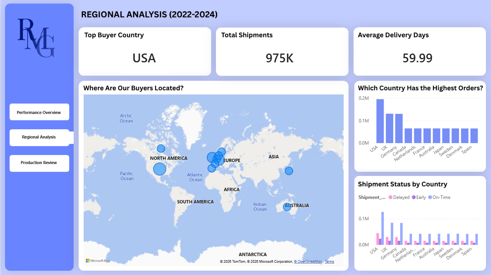
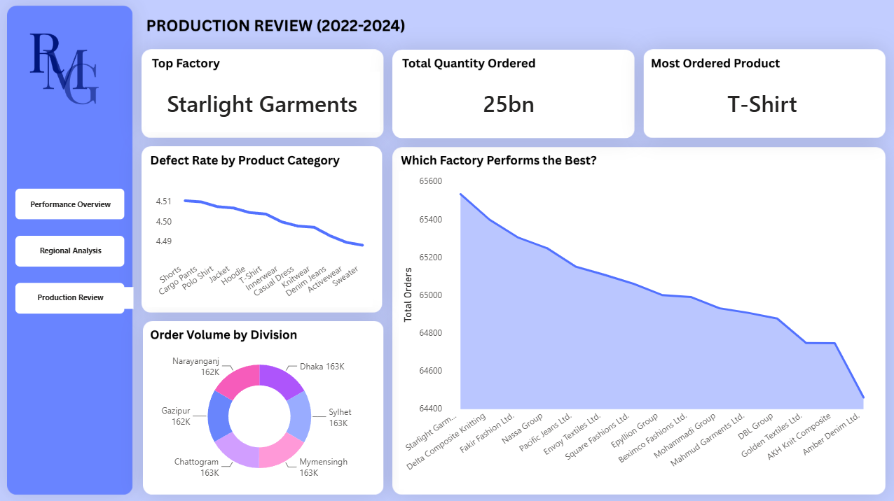

# 🏭 An RMG Industry Intelligence Report — Power BI Project

A self-driven data analytics project analyzing Bangladesh's Ready-Made Garments (RMG) industry across production performance, shipment efficiency, factory output, defect rates, and global buyer trends — built entirely in Microsoft Power BI on a custom-designed dataset of 975,440 rows.  

---

## 📌 Project Overview

Bangladesh is the second largest garment exporter in the world, yet data-driven decision-making in the RMG sector remains limited. This project simulates a real-world analytics scenario to demonstrate how production, shipment, and quality data can drive operational clarity for industry stakeholders.

The dashboard spans a full 3-year period (2022–2024) and is structured across 3 report pages — each answering a distinct set of business questions around performance, geography, and production.   

   
   
   

---

## 📊 Key Metrics at a Glance

| Metric | Value |
|--------|-------|
| Total Orders | 975,440 |
| Total Quantity | 25 Billion |
| On-Time Shipment Rate | 64.88% |
| Average Defect Rate | 4.50% |
| Top Buyer Country | USA |
| Average Delivery Days | 59.99 |
| Top Factory | Starlight Garments |
| Most Ordered Product | T-Shirt |
| Total Divisions Covered | 6 |
| Report Pages | 3 |

---

## 🗂️ Dataset Overview

This project uses a **custom-built dataset of 975,440 rows** — not sourced from Kaggle or any public repository. The dataset was intentionally designed to reflect realistic RMG industry patterns and benchmarks.

| Property | Detail |
|----------|--------|
| Total Rows | 975,440 |
| Total Columns | 12 |
| Time Period | 2022 – 2024 |
| Source | Custom-built (not publicly sourced) |

**Columns Included:**

`Order_ID` · `Factory_Name` · `Buyer_Country` · `Product_Category` ·
`Order_Date` · `Shipment_Date` · `Delivery_Deadline` · `Quantity_Ordered` ·
`Defect_Rate_%` · `Shipment_Status` · `Season` · `Division`

> **Transparency Note:** This dataset was custom-generated for portfolio
> demonstration purposes. All factory names, buyer patterns, and performance
> metrics are simulated but based on realistic industry benchmarks.
> No real company data was used.
> Dataset: Custom-built, 9,75,440 rows. Not sourced from Kaggle or any public repository. Available upon request.   

---

## 📑 Dashboard Pages

### Page 1 — Performance Overview (2022–2024)

A high-level command center showing the overall health of RMG operations
across the full three-year period.

- **KPI Cards** — Total Orders (975K), Total Quantity (25bn), On-Time Rate (64.88%), Average Defect Rate (4.50%)   
- **Shipment Trends Over Time** — Grouped bar chart tracking Delayed, Early, and On-Time shipments across 2022, 2023, and 2024   
- **Shipment Status Breakdown** — Donut chart showing On-Time (633K), Delayed (225K), and Early (118K) distribution   
- **Which Season Drives the Most Orders?** — Line chart comparing order volume across Spring, Summer, Fall, and Winter   
- **Top Buyer Countries** — Bar chart ranking buyer nations by total quantity ordered; USA leads significantly   

---

### Page 2 — Regional Analysis (2022–2024)

A geographic deep-dive into where orders are coming from and how well shipments are performing by country.

- **KPI Cards** — Top Buyer Country (USA), Total Shipments (975K), Average Delivery Days (59.99)   
- **Where Are Our Buyers Located?** — World map visual plotting buyer concentration across North America, Europe, and Australia   
- **Which Country Has the Highest Orders?** — Bar chart ranking all buyer countries by order volume   
- **Shipment Status by Country** — Grouped bar chart comparing Delayed, Early, and On-Time performance for each buyer country   

---

### Page 3 — Production Review (2022–2024)

A factory and product-level analysis of production output, quality control, and divisional performance. 

- **KPI Cards** — Top Factory (Starlight Garments), Total Quantity Ordered (25bn), Most Ordered Product (T-Shirt)   
- **Defect Rate by Product Category** — Line chart tracking defect rates across all 12 product categories including T-Shirts, Shorts, Denim Jeans, Knitwear, and more   
- **Which Factory Performs the Best?** — Line chart ranking 15+ factories by total order volume; Starlight Garments leads
- **Order Volume by Division** — Donut chart showing near-equal distribution across 6 divisions: Dhaka (163K), Sylhet (163K), Mymensingh (163K), Chattogram (163K), Gazipur (162K), and Narayanganj (162K)   

---

## 🔍 Key Findings

**1. Delivery Reliability is a Critical Gap**
Only 64.88% of shipments are on time — meaning roughly 35 out of every 100 orders face delays. For a globally competitive industry, this represents a serious operational and buyer retention risk.   

**2. Defect Rates Are Systemic, Not Category-Specific**
Defect rates across all product categories fall within a narrow band of 4.49%–4.51%. This uniformity points toward factory-level process standardization issues rather than product-specific problems. At 975,440 orders, even a 1% defect rate means thousands of affected shipments annually.   

**3. Export Concentration Creates Vulnerability**
The USA, UK, and Germany dominate buyer volume. Over-reliance on a small cluster of Western markets creates exposure to geopolitical shifts, trade policy changes, and fast-fashion market downturns.   

**4. Divisional Production is Evenly Distributed**
All six divisions contribute approximately 162,000–163,000 orders each — indicating no single division dominates capacity, which is a positive signal for geographic workforce stability.   

**5. Spring Leads Seasonal Demand**
Spring records the highest order volume (246K), with a consistent decline through Summer, Fall, and Winter — suggesting seasonal planning opportunities for factory capacity optimization.   

---

## 🛠️ Tools & Features Used

- Microsoft Power BI Desktop   
- Custom Dataset Design (975,440 rows)   
- DAX (calculated measures and KPIs)   
- Multi-page Report Structure (3 pages)   
- KPI Cards   
- Grouped Bar Chart   
- Donut Chart   
- Line Chart   
- World Map Visual (Bing Maps)   
- Navigation Buttons (page-to-page)   
- Dashboard Layout & Visual Storytelling   

---

## 💡 Key Learnings

- How to design a domain-specific dataset from scratch that reflects realistic industry patterns   
- Structuring a multi-page Power BI report around clear business questions rather than just visual display   
- Using DAX to build meaningful KPI measures from raw data   
- Thinking analytically about what the data means for real stakeholders — not just what it shows   
- Translating data findings into actionable recommendations   
- Communicating insights through a written analytics report alongside the dashboard   

---

## 📄 Analytics Report

This project includes a written **Analytics Report** (PDF) prepared alongside the dashboard. The report covers:

- Project context and objective     
- Dataset overview and transparency note   
- Section-by-section findings for all 3 dashboard pages   
- Actionable recommendations for each finding   
- A concluding summary of the 3 core industry challenges   

> The report is available in this repository as `Report.pdf`    

---

## 👤 Author

**Md. Sirajul Islam**   
📎 [linkedin.com/in/md-sirajul-islam57](https://linkedin.com/in/md-sirajul-islam57)   
🐙 [github.com/sirajul-islam5](https://github.com/sirajul-islam5)   

---

## 📄 License

This project is open source and available under the
[MIT License](LICENSE).

---

> *This is a self-driven project created for learning and
> portfolio purposes. The dataset is custom-built and does
> not represent any real company or organization.*
